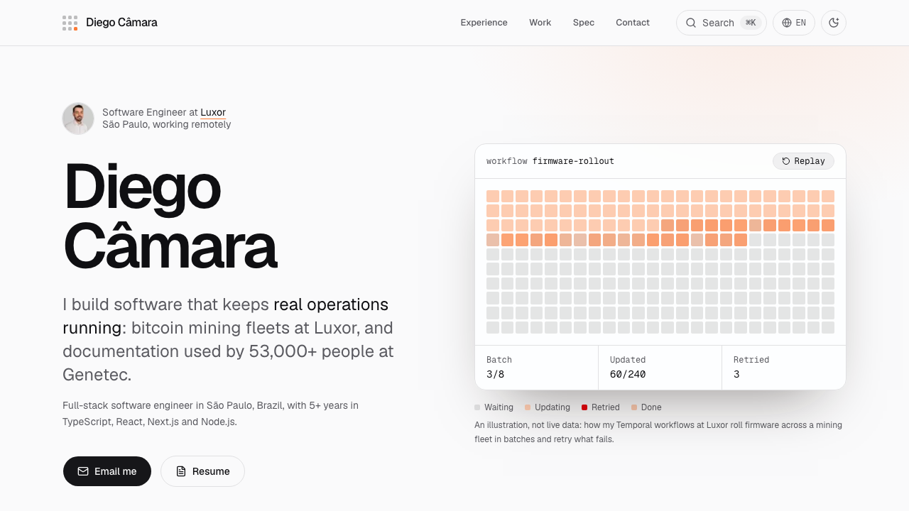

# www.diegocamara.com

<a href="https://www.diegocamara.com/?utm_source=github&utm_medium=repo">
  <picture>
    <source media="(prefers-color-scheme: dark)" srcset=".github/readme/hero-dark.png">
    
  </picture>
</a>

Personal site of Diego Câmara, full-stack software engineer. Four languages ([en](https://www.diegocamara.com/en), [pt](https://www.diegocamara.com/pt), [fr](https://www.diegocamara.com/fr), [es](https://www.diegocamara.com/es)), Lighthouse 100, and written to be read by recruiters and AI agents alike.

## What's worth a look

- **One source of truth.** Facts (roles, dates, links, stack) live in [`src/lib/data.ts`](src/lib/data.ts); every sentence lives in [`src/i18n/dictionaries`](src/i18n/dictionaries), typed against English so a missing translation fails the build. The page, the four resume PDFs, `llms.txt`, the Markdown pages and `AGENTS.md` are all generated from those two places.
- **Resumes generated from the site.** `bun run resume` renders an A4 PDF per language with Playwright ([`scripts/resume-pdf.ts`](scripts/resume-pdf.ts)).
- **A performance budget in CI.** Every PR runs type-check, lint, unit tests, Playwright end-to-end and Lighthouse CI: 100 on accessibility, best practices and SEO, performance of at least 98, and at most 200 KB of JavaScript. The command menu, language menu and analytics load on first interaction, not on page load.
- **Cookieless analytics.** PostHog loads only in production and only after the first interaction, through a same-origin `/ingest` proxy: no cookies, no storage, no consent banner. Clicks become named events (resume downloads, contact clicks, project opens); `/?internal` stops tracking in the owner's browser.
- **Readable by agents.** [`llms.txt`](https://www.diegocamara.com/llms.txt), [`llms-full.txt`](https://www.diegocamara.com/llms-full.txt), a Markdown copy of every page ([`/en.md`](https://www.diegocamara.com/en.md)), [`AGENTS.md`](https://www.diegocamara.com/AGENTS.md), JSON-LD (Person, ProfilePage, FAQPage), hreflang for all four languages and IndexNow pings on deploy.
- **Localized all the way down.** `/` picks the language from the browser; unknown URLs get a 404 in the URL's or the browser's language; old blog URLs redirect permanently.

## Stack

Next.js 16 (App Router, `proxy.ts`), React 19, TypeScript, Tailwind CSS v4, shadcn/ui on Base UI, bun, Playwright, Lighthouse CI, PostHog, Vercel.

## Run it

```bash
bun install
bun dev             # http://localhost:3000
bun run test        # unit tests
bun run build
bun run e2e         # Playwright, against the production build
bun run lighthouse  # Lighthouse budgets, same as CI
bun run resume      # regenerate the four resume PDFs
```

## Where things live

```
src/app/[lang]/               page, metadata and JSON-LD
src/app/global-not-found.tsx  localized 404
src/app/md/[lang]/            Markdown copy of each page, served at /{lang}.md
src/i18n/                     locales, language negotiation, dictionaries
src/lib/data.ts               facts
src/lib/llms.ts               llms.txt, Markdown pages, AGENTS.md, FAQ JSON-LD
src/lib/resume.ts             resume HTML behind the PDFs
src/lib/analytics.ts          click-to-event mapping and the PostHog loader
src/proxy.ts                  locale, trailing-slash and legacy redirects
```
